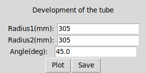
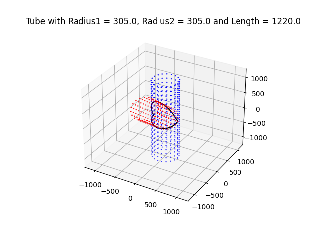
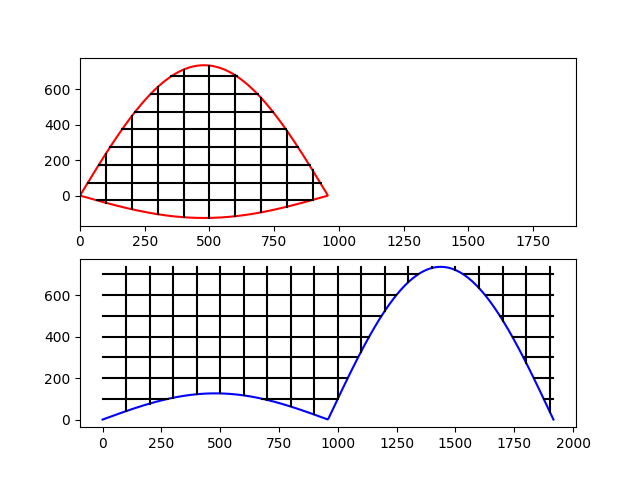

# TeeJointDeveloper
This script is designed for visualizing the development of a tubes intersection and generating its SVG representation. It uses `numpy`, `matplotlib`, and `svgwrite` libraries.

# Preview

